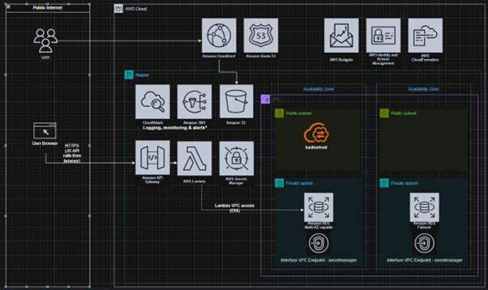
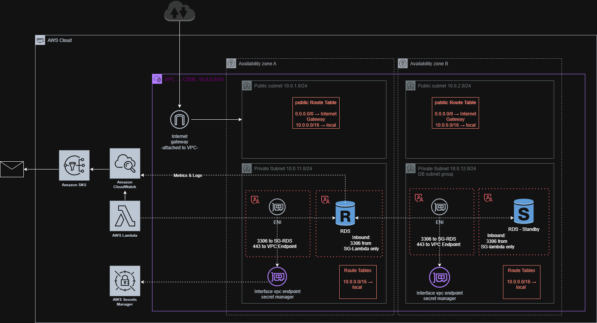

# TrainHub – Serverless Booking System on AWS

TrainHub is a cloud-native booking system built using AWS serverless services.  
The project demonstrates a secure and scalable backend architecture using managed AWS services.

---

# Architecture

System flow:

User → CloudFront → S3 → API Gateway → Lambda → RDS

The system uses a serverless backend architecture where users interact with a static frontend hosted in Amazon S3 and distributed globally through Amazon CloudFront.  
All application requests are processed through API Gateway and handled by AWS Lambda which communicates with the backend database in Amazon RDS.

---

# Network Topology

The infrastructure is deployed inside a dedicated Amazon VPC.

Public subnets:
- Reserved for potential future resources such as a bastion host.

Private subnets:
- AWS Lambda (via ENI)
- Amazon RDS database

Sensitive components such as the database are isolated in private subnets and are not accessible from the public internet.  
Security Groups ensure that only authorized services can communicate with each other.

---

# AWS Services Used

- AWS Lambda
- Amazon API Gateway
- Amazon RDS (MySQL)
- Amazon S3
- Amazon CloudFront
- AWS Secrets Manager
- Amazon VPC
- Amazon CloudWatch
- Amazon SNS
- AWS Budgets
- AWS CloudFormation

---

# Security

Key security features:

- Private VPC architecture
- RDS deployed in private subnets
- IAM roles with least privilege access
- Secrets stored securely in AWS Secrets Manager
- No public database access
- TLS encryption for all API communication
- Security Groups restricting network traffic

---

# Infrastructure as Code

The infrastructure is deployed using AWS CloudFormation.

The CloudFormation template provisions networking, database infrastructure, serverless components, and monitoring resources automatically.

---

# Documentation

Detailed documentation can be found in the **docs/** folder:

- Architecture
- Security
- Technical-report

---

# Future Improvements

- Add authentication with Amazon Cognito
- Protect API using AWS WAF
- Implement CI/CD pipeline
- Add automated tests
- Implement RDS Proxy for improved connection handling

---

# Author

Iman Jafari
