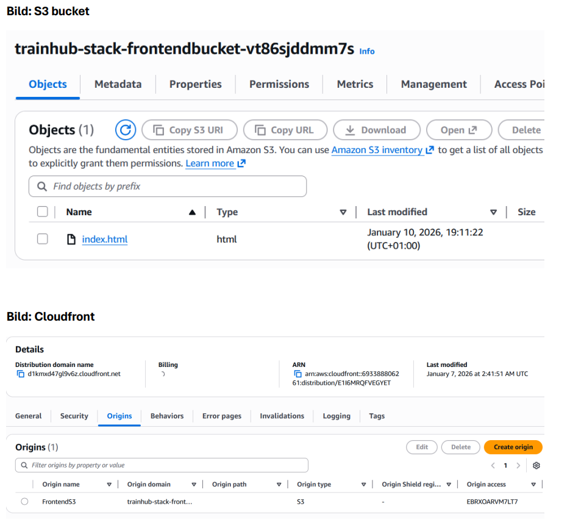
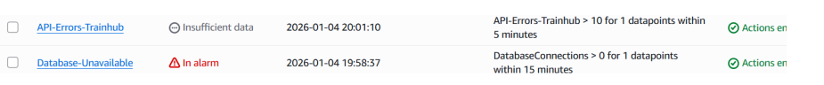

# Architecture Overview

The TrainHub system is a cloud-native booking platform built entirely on AWS using a serverless architecture.

The goal of the architecture is to create a system that is:

- Secure
- Scalable
- Cost-efficient
- Easy to maintain

The solution uses managed AWS services to reduce operational overhead and allow the system to automatically scale based on demand.

According to the project design, the system is divided into multiple layers to create a clear separation of responsibilities. :contentReference[oaicite:0]{index=0}

---

# System Architecture

High level request flow:

User → CloudFront → S3 → API Gateway → Lambda → RDS

The frontend is delivered globally using Amazon CloudFront which distributes static website files stored in Amazon S3.

All dynamic requests are sent through API Gateway which acts as the public entry point to the backend services.

AWS Lambda processes incoming API requests and handles the application logic. Lambda retrieves database credentials from AWS Secrets Manager and communicates with the backend database hosted in Amazon RDS.

---

# Network Design

The infrastructure is deployed inside a dedicated Amazon VPC.

The VPC contains:

Public Subnets
- Reserved for potential future resources such as bastion hosts.

Private Subnets
- AWS Lambda (via ENI)
- Amazon RDS database

Sensitive components such as the database are isolated inside private subnets and cannot be accessed directly from the internet.

Security groups restrict network traffic so that only necessary communication between services is allowed.

---

# Database Layer

The backend database is implemented using Amazon RDS (MySQL).

The database contains three core tables:

- members
- training_passes
- bookings

Business logic for creating bookings is implemented as a stored procedure inside the database. This ensures that critical rules such as preventing double bookings and enforcing capacity limits are always applied. :contentReference[oaicite:2]{index=2}

---

# Serverless Backend

The backend application is implemented using AWS Lambda.

Lambda acts as a coordinator that:

- retrieves secrets from AWS Secrets Manager
- connects to the RDS database
- executes stored procedures
- returns responses through API Gateway

This approach keeps the application lightweight and allows automatic scaling based on incoming traffic.

---

# CloudFront CDN

---

## Monitoring

---

# Infrastructure as Code

The infrastructure can be deployed using AWS CloudFormation.

The CloudFormation template provisions:

- VPC networking
- subnets
- security groups
- RDS database
- Lambda function
- API Gateway
- Secrets Manager
- monitoring resources

Using Infrastructure as Code allows the entire system to be recreated automatically and consistently.
