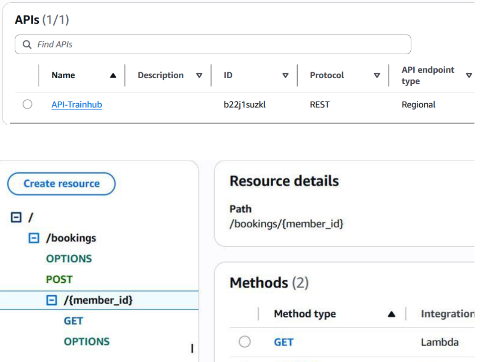
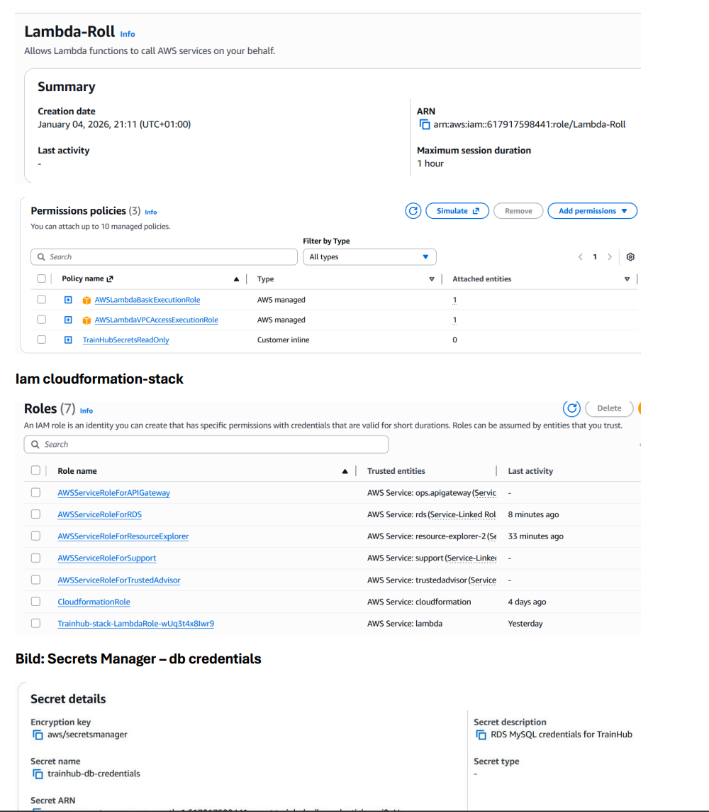
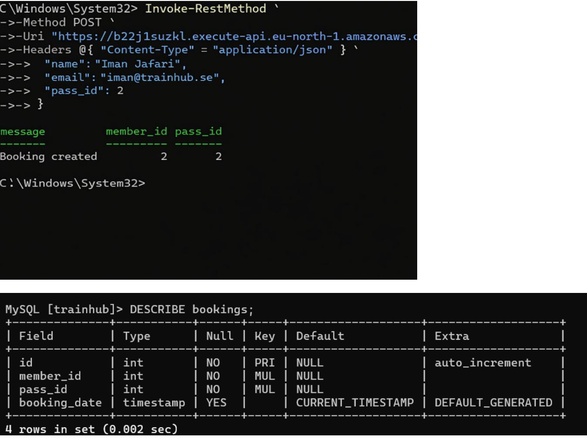
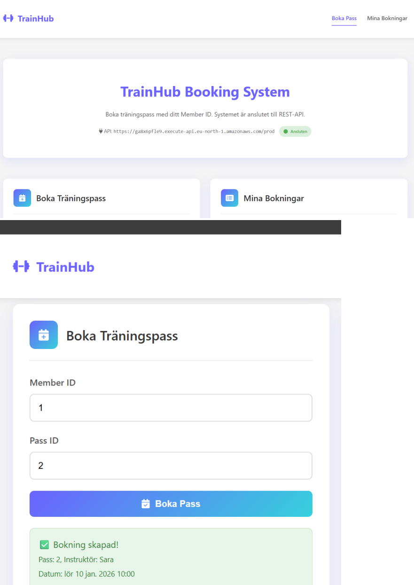
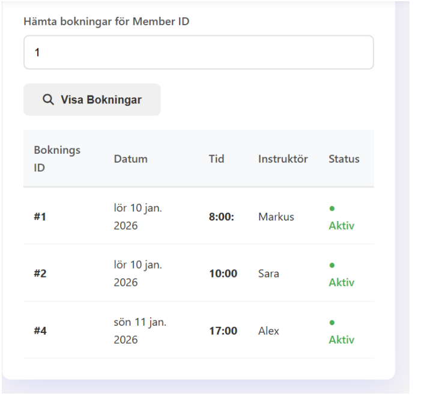

# Technical Implementation

This document describes how the TrainHub backend system was implemented on AWS.

The goal of the implementation was to create a working backend architecture using serverless services and secure networking.

---

# Backend Components

The backend system consists of the following services:

API Gateway  
AWS Lambda  
Amazon RDS  
AWS Secrets Manager  

## API Gateway configuration

API Gateway exposes REST endpoints used by the frontend application.

Two primary endpoints were implemented:

POST /bookings  
Creates a new booking.

GET /bookings/{member_id}  
Returns all bookings for a specific user.

API Gateway forwards incoming requests to the Lambda function which processes the request and interacts with the database.

---

# Lambda Function

The Lambda function is responsible for coordinating all backend operations.

Its main tasks include:

- retrieving database credentials from Secrets Manager
- connecting to the RDS database
- executing stored procedures
- returning formatted responses to the API

The Lambda function is deployed inside the VPC using Elastic Network Interfaces (ENI) so that it can securely communicate with private resources.

---

# Database Logic

Instead of implementing booking logic entirely inside the Lambda function, the core booking rules are implemented inside the database using a stored procedure.

The stored procedure performs the following checks:

- verifies that the training session is not full
- prevents duplicate bookings
- updates the number of reserved slots

This ensures that business rules remain consistent regardless of how the database is accessed.

---

# Networking Challenges

During implementation, one challenge occurred when the Lambda function was moved into a private subnet.

Because private subnets do not have internet access, the Lambda function could not reach AWS Secrets Manager.

The solution was to create a VPC Interface Endpoint for Secrets Manager. This allowed the Lambda function to communicate with AWS services through the internal AWS network without requiring a NAT Gateway. :contentReference[oaicite:8]{index=8}

This design improved both security and cost efficiency.

---

# Monitoring and Reliability

CloudWatch logging was enabled for the Lambda function and API Gateway.

Two alarms were configured:

Lambda error alarm  
Triggers if the number of errors exceeds a defined threshold.

Database availability alarm  
Triggers if database connections drop below expected levels.

These alarms send notifications through Amazon SNS to allow early detection of system failures.

---

## Application Interface

The frontend provides a simple interface where users can view available training sessions and create bookings through the API.

---

# Summary

The implementation demonstrates how a modern serverless architecture can be built using AWS managed services.

Key characteristics of the system include:

- serverless backend
- private network isolation
- secure secret management
- automated monitoring
- infrastructure as code

This architecture provides a scalable and secure foundation that could be expanded for production use.
